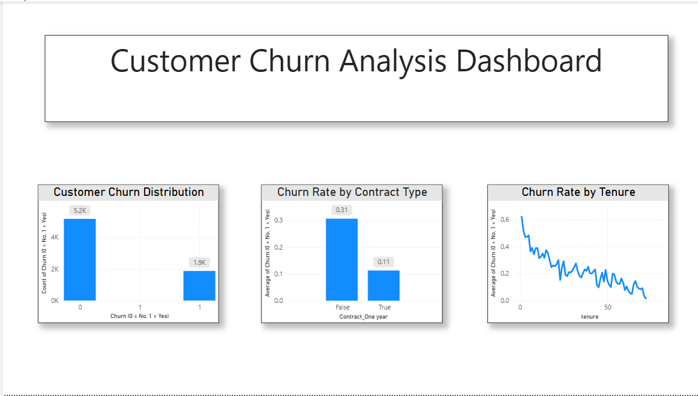

# 📊 Customer Churn Analysis

## 🔍 Project Overview

This project focuses on analyzing customer churn using data analytics and machine learning techniques. The goal is to identify patterns and factors that lead to customer churn and provide insights to improve customer retention.

---

## 🛠️ Tools & Technologies Used

* Python (Pandas, NumPy, Scikit-learn)
* Jupyter Notebook
* Power BI (for dashboard visualization)

---

## 📁 Dataset

The dataset contains customer information such as:

* Demographics (gender, senior citizen, etc.)
* Services (Internet, Phone, Streaming)
* Account details (tenure, contract, charges)
* Target variable: **Churn**

---

## ⚙️ Project Workflow

1. Data Cleaning & Preprocessing
2. Handling Missing Values
3. Encoding Categorical Variables
4. Model Building using Logistic Regression
5. Model Evaluation (Accuracy, Precision, Recall)
6. Data Visualization using Power BI

---

## 📈 Key Insights

* Customers with **no contract** have higher churn rates
* Customers with **low tenure** are more likely to churn
* Long-term customers are more stable
* Contract type significantly impacts customer retention

---

## 📊 Dashboard

The Power BI dashboard includes:

* Customer Churn Distribution
* Churn Rate by Contract Type
* Churn Rate by Tenure

---

## 🚀 Conclusion

This project helps businesses understand customer behavior and identify high-risk customers. These insights can be used to improve customer retention strategies and reduce churn.

---

## 📌 Author

**Ishika Ghosh**
